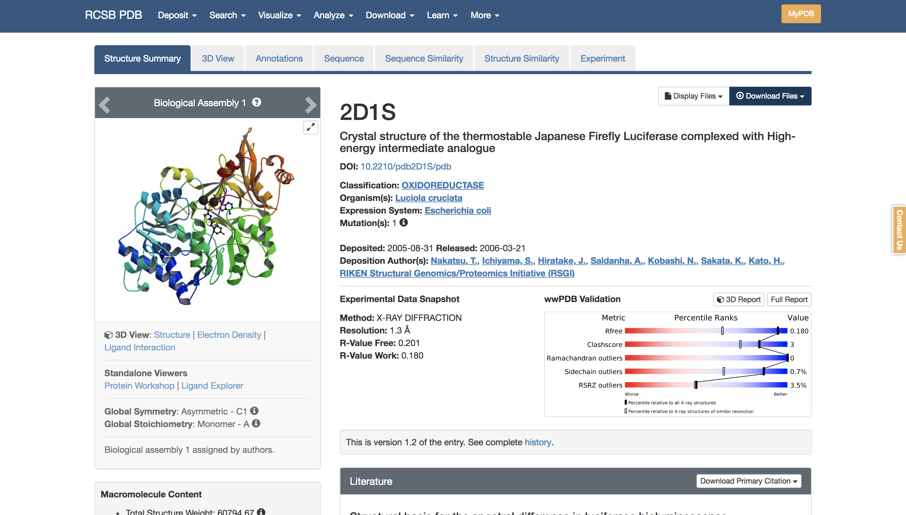

<div class="titulo" style="width: 80%; background-color: #ffffcc;font-size: 20px;padding:20px; text-align: center;">
  Bases de datos en Bioinformática
  <br>
  Bases de datos biológicas
</div>


## Introducción
Con el desarrollo de esta guía podrá familiarizarse con el uso e interpretación de dos de las bases de
datos más importantes en bioinformática: PDB y Uniprot. En sesiones posteriores hablaremos
detalladamente de otras bases de datos de gran interés, tales como EMBL y Genbak.


```{r setup, include=FALSE}
knitr::opts_chunk$set(echo = TRUE)
```

## PDB

<div class="titulo" style="width: 80%; background-color: #ffffcc;font-size: 20px;padding:20px; text-align: center;">
  <br>
    Visite la siguiente dirección:&nbsp;<a href="http://www.rcsb.org/" style="text-decoration: none">rsbc</a>
  <br>
</div>

<br>

En este momento se debe encontrar en el sitio web del Protein Data Bank (PDB):

<br>


<br>

Tal vez encuentre algunas diferencias , de acuerdo a la fecha en la que esté accesando este sitio. Sin embargo siempre encontrará que el sitio web de PDB tiene las misma arquitectura:
<ol>
  <li> Información general de la base de datos, tales como número de registros y estadísticas. </li>
  <li> Menú de navegación: donde se encuentran las diferentes secciones del sitio. Puede ser de
  especial ayuda para esta primera aproximación al PDB que consulte el enlace “gettin
  Started”. </li>
  <li> Barra de consulta: por medio de esta barra es posible realizar búsquedas (básicas o avanzadas)
  de nuestra molécula de interés en PDB, ya sea por ID, palabra clave o autor. </li>
  <li> Molécula del mes: mensualmente PDB selecciona una molécula, para la cuál provee información estructural y funcional muy completa. </li>
  <li> Barra lateral de noticias, con información concerniente a PDB. </li>
</ol>

<br>

<div class="titulo" style="width: 80%; background-color: #ffffcc;font-size: 20px;padding:20px; text-align: center;">
  ¿Con cuantos registros cuenta actualmente el PDB?
  <br>
  ¿Cual es el total de estructuras obtenidas por cristalografía de rayos X y microscopía electrónica en el PDB hasta este año?
</div>

<br>

<div class="titulo" style="width: 80%; background-color: #ffffcc;font-size: 20px;padding:20px; text-align: center;">
  Ingrese el siguiente identificador en la casilla de búsqueda: 2d1s 
  <br>
  Presione el botón “site search”
</div>

<br>

Después de unos segundo se encontrarácon el resultado de su búsqueda:

<br>



<br>

Esta página de resultados le muestra información general concerniente a su búsqueda, esta vez mediante el identificador 2d1s, que corresponde a la molécula llamada Luciferasa.
Examine cuidadosamente la página de resultados y responda las preguntas a continuación:

<br>

<div class="titulo" style="width: 80%; background-color: #ffffcc;font-size: 20px;padding:20px; text-align: center;">
  ¿En que fecha fue depositada esta estructura?
  <br>
  ¿Cuál fue el método experimental mediante el que se obtuvo?
  <br>
  ¿Qué significado cree usted que tienen los rótulos: <strong style="color:blue";>“Blue:Primary data”</strong> y <strong style="color:red;">“Red: Derived data”</strong> que se encuentran en la parte superior izquierda?
</div>

<br>

<input type=button class=hideshow> 
  
</input>

<ul>
Fecha de depísito: 2005-08-31.
<br>
Se obtuvo mediante difracción de rayos X (X-RAY DIFFRACTION).
<br>
No están presentes, como ya hablamos en clase.
</ul>

<br>

En la parte superior derecha de esta página es posible visualizar esta estructura desde su navegador con cualquiera de los programas de visualización que allí se ofrecen (King, jmol, WbMol etc.).

<br>

<div class="titulo" style="width: 80%; background-color: #ffffcc;font-size: 20px;padding:20px; text-align: center;">
  Explore brevemente las diferentes opciones de visualización.
</div>

<br>

En la parte superior de la página de resultados, encontrará una serie de pestañas que aportan mayor información acerca de la molécula.

<br>

<div class="titulo" style="width: 80%; background-color: #ffffcc;font-size: 20px;padding:20px; text-align: center;">
  Explore cada una de estas pestañas y explique, brevemente, qué información provee cada una de ellas.
</div>

<br>

<input type=button class=hideshow> 
  
</input>

<ul>
Structure Summary: incluye un resumen de los datos característicos de la molécula.
<br>
3d View: visualizador de la estructura tridemensional de la molécula.
<br>
Annotations: anotaciones sobre la molécula.
<br>
Sequence: secuencia que la genera.
<br>
Sequence Similarity: lista de otras secuencias similares ordenadas por porcentaje de similaridad.
<br>
Structure Similarity: similar a la anterior pero referente a similiritudes estructurales.
<br>
Experiments: datos que permiten reproducir los experimentes que han dado lugar a localizarla y caracterizarla.
</ul>

<br>

## Formato de archivo

<br>

Al determinar la estructura tridimensional de una proteína, obtenemos en realidad es información detallada de cada una de las coordenadas de sus componentes. Esta información se guarda en un archivo de texto, en un formato específico.

<br>

<div class="titulo" style="width:  80%; background-color: #ffffcc; font-size: 20px; padding: 20px; text-align: center;">
  Presione el enlace “Download files”, del menú de navegación a la izquierda.
</div>

<br>

Encontrará una serie de enlaces a archivos para descargar. De estos los más conocidos son **PDB** y
**mmCIF**.

<div class="titulo" style="width:  80%; background-color: #ffffcc; font-size: 20px; padding: 20px; text-align: center;">
  Presione el enlace “PDB File” y guardelo en su computador.
</div>

<br>

Este archivo es un archivo de texto, solamente que con extensión .PDB y puede ser abierto con cualquier editor de texto (Block de notas o Wordpad en sistemas MS windows o kate, kwrite, vim o Gedit en GNU/Linux).

<br>

<div class="titulo" style="width: 80%; background-color: #ffffcc;font-size: 20px;padding:20px; text-align: center;">
  Abra el archivo y examinelo cuidadosamente. Preste especial atención a las líneas que comienzan con la palabra ATOM. ¿Que información proveen?
</div>

<br>

<input type=button class=hideshow> 

</input>
<ul>
Se trata de la información necesaria para crear una representación 3D de la molécula.
</ul>

<br>

Como podrá notarlo este archivo contiene bastante información y entenderla, por lo menos globalmente, resulta importante.

<br>

<div class="titulo" style="width: 80%; background-color: #D8D8D8;font-size: 20px;padding:20px; text-align: center;">
  Para mayor información acerca de este formato, revise la siguiente guía explicativa que ofrece el sitio web de PDB:
  http://www.wwpdb.org/documentation/format23/v2.3.html
</div>

<br>

<div class="titulo" style="width: 80%; background-color: #ffffcc;font-size: 20px;padding:20px; text-align: center;">
  Siga el enlace del menú izquierdo: “structural analysis  Geometry  Molprobity Ramachandran plot”. Esto generará un archivo descargable en formato PDF. Descarguelo y visualícelo.      <br>
  ¿Qué información provee este tipo de gráfico?
</div>

<br>

<input type=button class=hideshow>

</input>

<ul>
El enlace no me ha funcionado.
</ul>

<br>

## Uniprot

<br>

<div class="titulo" style="width: 80%; background-color: #ffffcc;font-size: 20px;padding:20px; text-align: center;">
 Visite la siguiente dirección: http://www.pir.uniprot.org/
</div>
 
Esa acción le llevará al sitio web de UNIPROT:
 
<br>


<br>

Uniprot es, en realidad, la reunión de varias bases de datos de proteínas. y se encuentra dividida en tres grandes secciones: Uniparc, UniprotKb y Uniref.

<br>

<div class="titulo" style="width: 80%; background-color: #ffffcc;font-size: 20px;padding:20px; text-align: center;">
  Haciendo uso de la sección “About Uniprot  Background” explique en qué consiste cada una de estas divisiones.
</div>

<br>

<input type=button class=hideshow> 

</input>

<ul>
Uniparc: es una archivo (base de datos) de secuencias.
<br>
UniprotKb: sistema automático de anotación, anota los elementos almacenados en Uniparc.
<br>
Uniref: agrupaciones de secuencias.
</ul>

<br>

Como podrá notarlo, en la parte superior derecha del sitio web de UNIPROT se encuentra una casilla de búsqueda.

<br>

<div class="titulo" style="width: 80%; background-color: #ffffcc;font-size: 20px;padding:20px; text-align: center;">
 Haga una búsqueda de la molécula de luciferasa (Luciferase en inglés). Presione el botón con una flecha a la derecha de esta casilla.
</div>

<br>

Después de uno segundos aparecerá la página de resultados:
 
 <br>

 
 
<br>

<div class="titulo" style="width: 80%; background-color: #ffffcc;font-size: 20px;padding:20px; text-align: center;">
  ¿Cuantas entradas arroja esta búsqueda?
</div>

<br>
  
<input type=button class=hideshow> 

</input>

<ul>
Un total de 145,550 para este término.
</ul>

<br>

  La búsqueda que acaba de realizar es muy poco restringida, y de hecho lo que ha pasado es que el sistema de búsqueda de UNIPROT ha buscado el término “Luciferase” en cualquier campo de la base de datos y nos muestra los registros correspondientes.
Muchas veces esto no es lo que en realidad queremos, y necesitamos restringir nuestra búsqueda un poco más. Para esto podemos usar el formulario de búsqueda de esta página de resultados que se encuentra en la parte superior izquierda.

<br>

<div class="titulo" style="width: 80%; background-color: #ffffcc;font-size: 20px;padding:20px; text-align: center;">
  Realice la misma búsqueda, pero esta vez restringiendo las coincidencias al campo: “Paper title”, disponible en el menú desplegable del formulario. ¿Cuantos registros encontró esta vez?
</div>

<br>

<input type=button class=hideshow> 

</input>

<ul>
No encuentro ese campo en concreto, pero la búsqueda consistiría en presionar en la sección 'Advanced', en el desplegable seleccionar ese campo y realizar la búsqueda con ese criterio introduciéndo en el input el término designado.
</ul>

<br>

<div class="titulo" style="width: 80%; background-color: #ffffcc;font-size: 20px;padding:20px; text-align: center;">
CAJA GRI
 Experimente con las diferentes opciones de filtro que ofrece este formulario de búsqueda.
</div>

<br>

Ahora realizaremos una búsqueda no tan abierta, sino a partir de un identificador ya conocido (de manera similar a como lo hicimos en PDB).
 
<br>

<div class="titulo" style="width: 80%; background-color: #ffffcc;font-size: 20px;padding:20px; text-align: center;">
  Realice la búsqueda de la siguiente molécula: P05938. Seleccione la entrada, haciendo click en la casilla de selección.
</div>

<br>


<br>

<div class="titulo" style="width: 80%; background-color: #ffffcc;font-size: 20px;padding:20px; text-align: center;">
  Descargue el archivo en formato “flatfile” correspondiente a esta entrada haciendo uso de la casilla de opciones de descarga.
</div>

<br>

<div class="titulo" style="width: 80%; background-color: #D8D8D8;font-size: 20px;padding:20px; text-align: center;">
  Este es también un archivo de texto, puede abrirlo y examinarlo con su editor de textos preferido.
</div>
 
 <br>
 

 
 
 <div class="titulo" style="width: 80%; background-color: #ffffcc;font-size: 20px;padding:20px; text-align: center;">
  Una vez descargue el archivo de resultados siga el enlace: “LBP_RENRE”.
</div>
  
<br>
 
  En este momento debe encontrarse con la página de la entrada correspondiente a la molécula: “Luciferin binding protein”, la cual consta de varias secciones. Revise estas secciones cuidadosamente y responda las siguientes preguntas:

<br>

<div class="titulo" style="width: 80%; background-color: #ffffcc;font-size: 20px;padding:20px; text-align: center;">
  ¿Cuál es la función de esta molécula?
  <br>
  ¿Cuál es su nombre?
  <br>
  ¿A que organismo corresponde? 
  <br>
  ¿Cuál es su peso molecular?
</div>

<br>

<input type=button class=hideshow> 

</input>

<ul>
La molécula participa en la absorción de los iones de cálcio (calcium ion binding).
<br>
Renilla reniformis (Sea pansy).
<br>
20,539
</ul>
 
 

<script>
$( "input.hideshow" ).each( function ( index, button ) {
  button.value = 'Hide Output';
  $( button ).click( function () {
    var target = this.nextSibling ? this : this.parentNode;
    target = target.nextSibling.nextSibling.nextSibling.nextSibling;
    if ( target.style.display == 'block' || target.style.display == '' ) {
      target.style.display = 'none';
      this.value = 'Show Output';
    } else {
      target.style.display = 'block';
      this.value = 'Hide Output';
    }
  } );
} );
</script>
